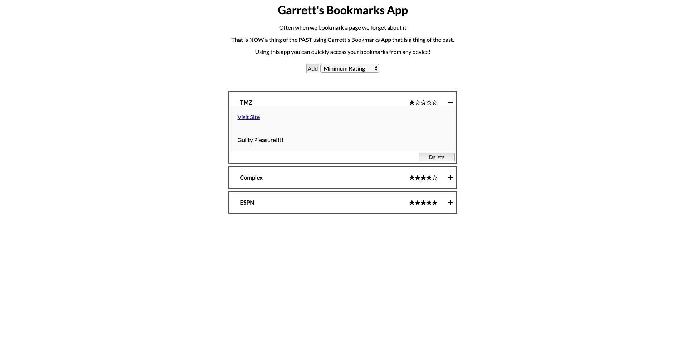

# garrett-bookmark-app

A personal internet bookmark application, that users can create lists of their favorite bookmarks to keep track and easily access.

## Motivation

I also bookmark sites, but often forget why and how useful the bookmark actually is. So I would end up never using the bookmarks. I wanted a bookmark app that I could access on any device with a rating and description. Bookmarks and lists are all created by the users.

## Screenshots
Active Screen:

## Built With

### Front-End
* HTML
* CSS
* JS
* jQuery

## Features
* Create a list of bookmarks
* rate your bookmarks
* filter by rating

## Demo

- [Live Demo](https://gjames5355.github.io/garrett-bookmark-app/)